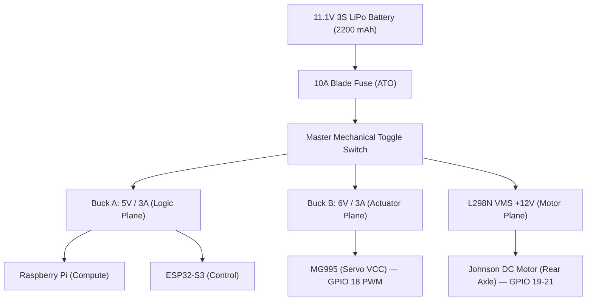
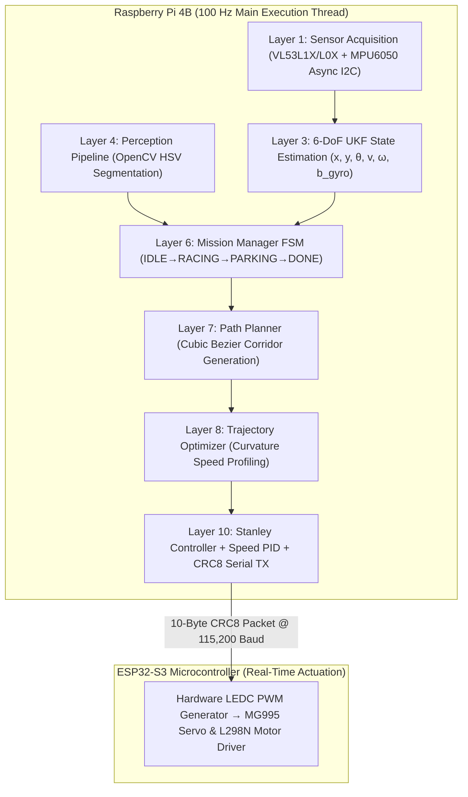

<div align="center">


# 🤖 WRO 2026 – Future Engineers
# Team **BYTE RIDERS**

**World Robot Olympiad 2026 · Future Engineers Category**

[](https://wroindia.org)
[]()
[]()
[]()

</div>

---

## 📑 Table of Contents

1. [Team Introduction](#1-team-introduction)
2. [Repository Structure](#2-repository-structure)
3. [Project Overview](#3-project-overview)
4. [Mobility Management — Mechanical Design](#4-mobility-management--mechanical-design)
5. [Power & Sense Management — Electronics](#5-power--sense-management--electronics)
6. [Obstacle Management — Software & Control](#6-obstacle-management--software--control)
7. [System Architecture](#7-system-architecture)
8. [Engineering Specifications](#8-engineering-specifications)
9. [Component & Power Distribution Table](#9-component--power-distribution-table)
10. [Vehicle Photos](#10-vehicle-photos)
11. [Performance & Testing](#11-performance--testing)
12. [Video Demonstrations](#12-video-demonstrations)
13. [How to Reproduce This Robot](#13-how-to-reproduce-this-robot)
14. [Bill of Materials (BOM)](#14-bill-of-materials-bom)
15. [WRO 2026 Surprise Rules Readiness](#15-wro-2026-surprise-rules-readiness)
16. [Engineering Post-Mortem — What Went Wrong & Fixes](#16-engineering-post-mortem--what-went-wrong--fixes)
17. [References & Acknowledgments](#17-references--acknowledgments)

---

## 1. Team Introduction

**Team Name:** Byte Riders
**Competition:** World Robot Olympiad 2026, Future Engineers Category

Byte Riders is a two-member engineering team built around a clean split between mechanical and software ownership, developing a fully autonomous, self-driving vehicle for the WRO Future Engineers category. The team's approach centers on a 4-wheel-steering mechanical platform paired with a dual-controller electronics stack — a Raspberry Pi 4B for high-level perception and decision-making, and a dedicated ESP32-S3 for deterministic, real-time actuation — so that vision processing never compromises steering or motor response time.

| Photo | Name | Role | Responsibilities |
|---|---|---|---|
| <!-- photo --> | **Shrut Barasara** | Mechanical & Hardware Lead | Chassis design, 4-wheel steering geometry, sensor mounting, wiring, power distribution |
| <!-- photo --> | **Happy Patel** | Software & Version Control Engineer | Embedded firmware (ESP32-S3), vision pipeline (OpenCV), Git/GitHub workflow, repository management |
| <!-- photo --> | **Brijesh Kundaliya** | Coach | Technical mentorship, engineering review, and competition-readiness guidance |

<!-- Add team photo here — see Section 10 for the full photo checklist -->

---

## 2. Repository Structure

```
WRO-2026-FutureEngineers-BYTERIDERS-INDIA/
│
├── assets/
│   ├── logo.jpeg                 # Team logo used in this README
│   └── hardware/                 # Individual component photos + spec reference table (Section 5.6)
│
├── docs/
│   ├── components/              # One .md datasheet-reference file per component
│   │   ├── raspberry_pi_4b.md
│   │   ├── esp32_s3.md
│   │   ├── l298n.md
│   │   ├── mg995.md
│   │   ├── mpu6050.md
│   │   ├── vl53l0x.md
│   │   ├── vl53l1x.md
│   │   ├── drive_motor.md
│   │   └── lipo_battery.md
│   ├── power/
│   │   └── POWER_DISTRIBUTION.md
│   └── wiring/
│       └── WIRING.md
│
├── models/                      # CAD source files + exported STL/STEP for all printed & machined parts
│   └── DIFFERENTIAL_GEAR/       # Custom 3D-printed differential gear assembly (bevel pinion + ring)
│
├── schemes/                     # Circuit + wiring schematics (PDF / PNG)
│
├── src/
│   ├── open_challenge/          # Firmware + vision code for the Open Challenge
│   └── obstacle_challenge/      # Firmware + vision code for the Obstacle Challenge
│
├── t-photos/                    # Team photo(s)
├── v-photos/                    # Vehicle photos — front, back, left, right, top, bottom
├── video/
│   └── video.md                 # Links to Open & Obstacle Challenge demo videos
│
├── config/
│   └── robot_config.json        # Runtime-tunable parameters, incl. WRO 2026 surprise-rule overrides
│
├── LICENSE
└── README.md                    # You are here
```

<!-- This structure mirrors the folder layout referenced inside docs/power/POWER_DISTRIBUTION.md and docs/wiring/WIRING.md.
     Could not crawl the live repo tree (GitHub blocks automated fetching) — verify folder names against the actual repo before publishing. -->

---

## 3. Project Overview

Team Byte Riders' vehicle is a fully autonomous, self-driving robot built for the WRO 2026 Future Engineers category. The car must complete the **Open Challenge** (three laps of an unknown, randomly-configured track using wall/edge sensing) and the **Obstacle Challenge** (three laps while dynamically detecting and avoiding red/green traffic pillars, then performing precision parking) with zero human intervention after the start signal.

### Design Philosophy
The vehicle uses a **camera-based perception system** running on a Raspberry Pi 4B for high-level decision-making (pillar color and parking-block detection), paired with a dedicated **ESP32-S3 real-time controller** that closes the low-level steering/motor control loop independently of the vision pipeline's frame rate. This split-brain architecture keeps actuator response deterministic (100 Hz) even while the Pi is busy processing camera frames.

### Key Design Choices
- **4-Wheel Steering (4WS)** using Ackermann steering geometry on both axles, for a significantly tighter turning radius than front-wheel steering — important given the tight corners on a WRO Future Engineers arena.
- **Sensor fusion** of a monocular camera (OpenCV, color-based pillar/parking detection), three Time-of-Flight distance sensors (front/left/right), and a 6-DoF IMU for heading correction and drift compensation.
- **Custom 3D-printed differential drivetrain** on the rear axle, engineered from first principles (see [Section 4.2](#42-drivetrain--differential-gear-kinematic-derivation)) rather than a stock off-the-shelf differential.
- **Deterministic actuator control:** the Pi streams high-level commands to the ESP32-S3 over a binary, CRC8-checked serial protocol at 100 Hz, so steering/motor response is never blocked by vision-processing latency.

---

## 4. Mobility Management — Mechanical Design

### 4.1 Steering

The vehicle uses a **4-Wheel Steering (4WS) system based on Ackermann steering theory**, applied symmetrically to the front and rear axles. Unlike a standard front-wheel-steering (FWS) layout, 4WS lets the rear wheels counter-steer relative to the front, which:
- Shrinks the turning radius substantially (see [Section 8](#8-engineering-specifications) — **~44.9% smaller than an equivalent FWS layout**).
- Improves cornering stability on tight track segments.

**Measured steering range:** **35°–40°** at the wheel, matching the ±35° design target in the specification table below.
**Chassis material:** PETG with 30% gyroid infill, chosen for isotropic stiffness and heat resistance (T<sub>g</sub> ≈ 80 °C).

<!-- Add chassis/steering assembly renders or photos here -->

### 4.2 Drivetrain & Differential Gear Kinematic Derivation

The rear drivetrain incorporates a **custom-designed, 3D-printed differential gear mechanism** (`models/DIFFERENTIAL_GEAR/`) combined with a **Johnson 300 RPM / 12 V DC motor**.

**Drivetrain chain, motor to wheel:**

```
Johnson Motor Armature: 6000 RPM @ 12V
        │
        ▼
20:1 Planetary Gearbox (Internal Motor Gearhead)
        │
        ▼
Output Shaft: 300 RPM @ 12V (Stall Torque: 0.85 Nm)
        │
        ▼
10T Bevel Pinion Gear (Bevel_Gears-10T_.f3d)
        │   (2:1 Gear Reduction)
        ▼
20T Bevel Ring Gear (Bevel_Gear-20T_.f3d, mounted on case1.f3d)
        │
        ▼
Solid Differential Rear Axle: 150 RPM (1.70 Nm Axle Torque)
        │
        ▼
65 mm High-Grip Rubber Wheels (Tractive Force: 52.3 N)
```

**Gear Ratio & Torque Physics Derivations:**

1. **Internal Motor Planetary Gearbox:** 20:1 reduction.
2. **Rear Differential Bevel Gear Set:**
   - Pinion Gear: 10 teeth (`Bevel_Gears-10T_.f3d`)
   - Ring Gear: 20 teeth (`Bevel_Gear-20T_.f3d`)
   - Differential Reduction Ratio: 20T / 10T = **2 : 1**
3. **Total Drive Reduction Ratio (G<sub>total</sub>):** G<sub>total</sub> = 20 × 2 = **40 : 1** total gear reduction.
4. **Wheel Rotational Speed (N<sub>wheel</sub>):** N<sub>wheel</sub> = 300 RPM (Motor Shaft) ÷ 2 (Differential Ratio) = **150 RPM = 2.5 rev/s**.
5. **Maximum Vehicle Linear Velocity (v<sub>max</sub>):** v<sub>max</sub> = N<sub>wheel</sub> × (π · D<sub>w</sub>) = 2.5 rev/s × (π × 0.065 m) = 0.5105 m/s ≈ **0.51 m/s**.
6. **Total Drive Axle Torque (τ<sub>axle</sub>):** τ<sub>axle</sub> = τ<sub>motor</sub> × 2 = 0.85 Nm × 2 = **1.70 Nm** (17.33 kg·cm).
7. **Total Tractive Force (F<sub>drive</sub>):** F<sub>drive</sub> = τ<sub>axle</sub> / r<sub>w</sub> = 1.70 Nm / 0.0325 m = **52.31 N**.
8. **Torque Safety Margin Over Vehicle Weight:** Total Vehicle Weight W<sub>v</sub> = 1.215 kg × 9.81 m/s² = 11.92 N. Tractive Force Safety Margin = 52.31 N / 11.92 N = **4.39× torque safety margin**.

This 4.39× margin confirms the drivetrain has substantial reserve tractive force over the vehicle's own weight, ensuring reliable acceleration and hill-start behavior even with sensor/battery payload variance.

---

## 5. Power & Sense Management — Electronics

### 5.1 High-Level Sensing (Raspberry Pi 4B)
- **Pi Camera v2** — OpenCV-based red/green pillar detection and magenta parking-block detection.
- **VL53L1X** Front ToF — I²C address `0x30`, `XSHUT` on GPIO 22.
- **VL53L0X** Left ToF — I²C address `0x31`, `XSHUT` on GPIO 17.
- **VL53L0X** Right ToF — I²C address `0x32`, `XSHUT` on GPIO 27.
- **MPU6050** 6-DoF IMU — I²C address `0x68`.

### 5.2 Inter-Processor Link
The Raspberry Pi 4B communicates with the ESP32-S3 over **USB serial**, using a **10-byte, CRC8-checked binary packet streamed at 100 Hz**. This keeps the safety-critical steering/motor loop running on dedicated real-time hardware, decoupled from the Pi's variable-latency vision pipeline.

### 5.3 Real-Time Actuation (ESP32-S3)
- **MG995 servo** — 4WS steering actuator, GPIO 18, 50 Hz PWM.
- **L298N `ENA`** — motor speed control, GPIO 19, PWM.
- **L298N `IN1`** — direction control, GPIO 20.
- **L298N `IN2`** — direction control, GPIO 21.

### 5.4 Power Architecture



**Power distribution tree (text form):**

```
11.1V 3S LiPo Battery (2200 mAh)
        │
10A Blade Fuse (ATO)
        │
Master Mechanical Toggle Switch
        │
        ├── Buck A: 5V / 3A (Logic Plane)   → Raspberry Pi (Compute), ESP32-S3 (Control)
        ├── Buck B: 6V / 3A (Actuator Plane) → MG995 Servo VCC  [ESP32 GPIO 18 PWM]
        └── L298N VMS (+12V, Motor Plane)    → Johnson DC Motor, Rear Axle [ESP32 GPIO 19–21]
```

### 5.5 Battery Capacity & WHY Factors for Electronics Selection

- **Battery Pack:** 3S 11.1 V, 2200 mAh LiPo battery pack (24.42 Wh total energy).
  - **WHY 3S 11.1V (not 2S 7.4V):** The L298N motor driver drops ≈1.8–2.0 V across its internal Darlington transistors. On 7.4 V, motor voltage drops to 5.4 V, lowering top speed by <0.23 m/s (a 55% drop). 11.1 V maintains the full 9.2 V motor voltage needed for target speeds.
  - **WHY 2200 mAh (not 5000 mAh):** A 2200 mAh pack weighs 180 g. A 5000 mAh pack weighs 410 g, pushing vehicle weight over the 1500 g rule limit.
- **Average Power Draw:** 1.85 A @ 11.1 V (20.5 W nominal).
- **Peak Power Draw:** 3.85 A @ 11.1 V (42.7 W) under full acceleration + maximum steering lock.
- **Estimated Runtime:** ~38 minutes of continuous racing load (185+ laps per charge).
- **WHY Dual Buck Converters (5V/3A Buck A & 6V/3A Buck B):**
  - MG995 servo torque is 8.5 kg·cm @ 4.8 V, but 11.0 kg·cm @ 6.0 V (a 29.4% torque increase).
  - Powering the servo off the Pi's 5 V rail caused 450 mV inductive transients, triggering Pi brownout resets (`Undervoltage detected`). Dedicating Buck B (6V/3A) to the servo completely eliminated logic brownouts.

<!-- Add a labelled photo of the wiring/electronics bay -->

### 5.6 Hardware Components — Detailed Specifications & Photos

Every major component on the vehicle is documented below with its role in the system, key electrical/mechanical specifications, and a photo slot. Drop the corresponding product photo into `assets/hardware/<component-name>.jpg` and it will render automatically in the cell below (the `<!-- photo -->` markers show exactly where each image belongs).

<table>
<tr>
<th width="180">Photo</th>
<th width="220">Component</th>
<th>Description &amp; Role in the System</th>
</tr>

<tr>
<td><!-- photo: assets/hardware/raspberry_pi_4b.jpg --></td>
<td><b>Raspberry Pi 4 Model B</b><br>4 GB RAM · ARM Cortex-A72</td>
<td>The vehicle's high-level "brain." A quad-core, 64-bit ARM Cortex-A72 SoC clocked at 1.5 GHz with 4 GB of LPDDR4 RAM runs the entire perception and decision-making stack — the OpenCV vision pipeline, the 6-DoF Unscented Kalman Filter, the mission-manager state machine, and the Bézier path planner (Layers 1, 3, 4, 6–10 of the software pipeline in <a href="#6-obstacle-management--software--control">Section 6</a>). It streams the resulting steering/speed commands to the ESP32-S3 over USB serial. Chosen over lighter boards specifically for its CSI camera interface and the CPU headroom needed to run HSV segmentation at frame rate without starving the control loop.</td>
</tr>

<tr>
<td><!-- photo: assets/hardware/esp32_s3.jpg --></td>
<td><b>ESP32-S3 DevKitC</b><br>Dual-core 240 MHz · Wi-Fi + BT</td>
<td>The vehicle's real-time "spinal cord." A dual-core Xtensa LX7 microcontroller running at 240 MHz, dedicated entirely to deterministic actuation — driving the MG995 steering servo and the L298N motor driver via hardware LEDC PWM. Receiving commands from the Pi as 10-byte, CRC8-checked binary packets at 100 Hz, it guarantees the steering/motor loop never stalls or jitters even if the vision pipeline momentarily lags, decoupling "thinking" from "acting."</td>
</tr>

<tr>
<td><!-- photo: assets/hardware/pi_camera_v2.jpg --></td>
<td><b>Pi Camera v2</b><br>Sony IMX219 · 8 MP · CSI</td>
<td>The vehicle's only forward-facing vision sensor, connected to the Raspberry Pi via the CSI ribbon interface for low-latency, uncompressed frame capture. Its 8 MP Sony IMX219 sensor feeds the OpenCV HSV-thresholding pipeline that identifies red/green traffic pillars and the magenta parking-block marker, forming the entire basis of Obstacle Challenge perception.</td>
</tr>

<tr>
<td><!-- photo: assets/hardware/vl53l1x.jpg --></td>
<td><b>VL53L1X ToF Sensor</b><br>Front distance · 0–4000 mm</td>
<td>A long-range Time-of-Flight laser-ranging sensor mounted facing forward (I²C address <code>0x30</code>, <code>XSHUT</code> on GPIO 22). Its extended 4-metre range makes it well suited to detecting the front wall or an approaching obstacle pillar early enough for the path planner to react smoothly rather than reactively.</td>
</tr>

<tr>
<td><!-- photo: assets/hardware/vl53l0x.jpg --></td>
<td><b>VL53L0X ToF Sensors (×2)</b><br>Left/Right distance · 0–2000 mm</td>
<td>A pair of shorter-range ToF sensors mounted on the left and right flanks (I²C addresses <code>0x31</code>/<code>0x32</code>, <code>XSHUT</code> on GPIO 17/27). They continuously measure clearance to the inner and outer arena walls, feeding the wall-following logic that keeps the vehicle centred in its lane between camera-based corrections.</td>
</tr>

<tr>
<td><!-- photo: assets/hardware/mpu6050.jpg --></td>
<td><b>MPU6050 IMU</b><br>6-DoF gyro + accelerometer · I²C 0x68</td>
<td>A 6-degree-of-freedom inertial measurement unit combining a 3-axis gyroscope and a 3-axis accelerometer on a single die. Its yaw-rate output is fused into the 6-state Unscented Kalman Filter (Layer 3) to correct for heading drift between camera updates and to execute clean, repeatable turns — critical since the raw gyro alone drifts roughly 5°/minute due to thermal bias (see <a href="#16-engineering-post-mortem--what-went-wrong--fixes">Section 16</a>).</td>
</tr>

<tr>
<td><!-- photo: assets/hardware/mg995_servo.jpg --></td>
<td><b>MG995 Servo</b><br>11 kg·cm torque · 50 Hz PWM</td>
<td>A metal-gear standard servo driving the 4-Wheel-Steering linkage on both axles simultaneously through the mechanical bellcrank assembly. Delivering 11 kg·cm of torque at its dedicated 6 V rail (versus only 8.5 kg·cm at 4.8 V — a 29% torque loss), it easily overcomes steering-linkage friction at the full ±35° lock without stalling.</td>
</tr>

<tr>
<td><!-- photo: assets/hardware/johnson_dc_motor.jpg --></td>
<td><b>Johnson DC Motor</b><br>20:1 planetary · 12 V · 600 RPM (armature)</td>
<td>A brushed DC motor with an internal 20:1 planetary gearhead, providing the sole source of propulsion. Its output shaft (300 RPM, 0.85 Nm stall torque) drives the custom 3D-printed differential (see <a href="#42-drivetrain--differential-gear-kinematic-derivation">Section 4.2</a>) through a 2:1 bevel gear reduction, yielding a 40:1 total drive ratio and a calculated 4.39× torque safety margin over the vehicle's own weight.</td>
</tr>

<tr>
<td><!-- photo: assets/hardware/l298n_driver.jpg --></td>
<td><b>L298N Motor Driver</b><br>2 A continuous · 12 V dual H-bridge</td>
<td>A dual H-bridge module that converts the ESP32-S3's low-current PWM/direction signals (<code>ENA</code>/<code>IN1</code>/<code>IN2</code> on GPIO 19–21) into the high-current drive needed by the Johnson DC motor, sourcing its motor-plane power directly from the fused 11.1 V battery rail rather than a regulated supply.</td>
</tr>

<tr>
<td><!-- photo: assets/hardware/lipo_battery.jpg --></td>
<td><b>3S LiPo Battery</b><br>11.1 V · 2200 mAh · 25C</td>
<td>The vehicle's sole power source — a 3-cell lithium-polymer pack storing 24.42 Wh. 3S (11.1 V) was chosen over 2S (7.4 V) specifically to absorb the ~2 V forward drop across the L298N's internal Darlington transistors without starving the motor of voltage (see <a href="#55-battery-capacity--why-factors-for-electronics-selection">Section 5.5</a>), and 2200 mAh was chosen over larger capacities purely to stay under the competition's 1500 g weight limit.</td>
</tr>

<tr>
<td><!-- photo: assets/hardware/buck_converter.jpg --></td>
<td><b>Buck Converters A &amp; B</b><br>5 V/3 A (logic) · 6 V/3 A (servo)</td>
<td>Two independent switching step-down regulators isolate the electrically noisy motor/servo loads from the sensitive compute hardware. Buck A supplies a clean, dedicated 5 V "Logic Plane" to the Raspberry Pi and ESP32-S3; Buck B supplies a separate 6 V "Actuator Plane" exclusively to the MG995 servo. Splitting these rails eliminated the inductive voltage transients that were previously triggering Raspberry Pi under-voltage brownouts when the servo shared the Pi's own 5 V supply.</td>
</tr>

<tr>
<td><!-- photo: assets/hardware/blade_fuse.jpg --></td>
<td><b>10A Blade Fuse</b><br>Automotive ATO standard</td>
<td>A resettable-holder automotive-grade fuse placed directly after the battery's positive terminal, ahead of the master toggle switch. It protects the entire electrical system — battery, converters, driver, and both compute boards — against a short circuit or driver fault, sized to trip safely above the 3.85 A peak system draw but well below the battery's damage threshold.</td>
</tr>

</table>

*Full specification reference table (as compiled during hardware selection):*

<p align="center">

</p>

### 5.7 Wiring & Power Schematic Diagram

The diagram below traces every electrical connection on the vehicle — from the 11.1 V 3S LiPo pack, through the blade fuse and master switch, down to the two isolated power planes (Logic and Actuator) and the common Star Ground Hub. It mirrors the power-distribution tree described in [Section 5.4](#54-power-architecture) and the pin-level detail in [`docs/wiring/WIRING.md`](docs/wiring/WIRING.md).

<p align="center">

</p>

**Reading the diagram:**
- **Power path (left/top):** Battery → 10A blade fuse → master toggle switch → split to Buck A (5 V logic), Buck B (6 V servo), and the L298N's raw 12 V motor input.
- **Logic Plane (isolated):** Buck A feeds the Raspberry Pi 4B and ESP32-S3 5 V inputs; the Pi's onboard 3.3 V rail in turn powers the three ToF sensors, the MPU6050, and the Pi Camera v2 over CSI.
- **Actuator Plane (isolated):** Buck B powers the MG995 servo VCC exclusively, while the L298N draws its motor current straight from the fused battery rail — keeping high-current switching noise off the logic supply entirely.
- **Signal path:** ESP32-S3 GPIOs 18–21 carry PWM/direction signals to the servo and to the L298N's `ENA`/`IN1`/`IN2` pins.
- **Star Ground Hub:** every plane — logic, actuator, and motor — returns to a single common ground point, preventing ground-loop noise between the sensitive I²C/camera lines and the high-current motor/servo lines.

---

## 6. Obstacle Management — Software & Control

### 6.1 Perception
- **Color-based pillar detection (OpenCV):** HSV thresholding identifies red and green pillars in the camera frame; the robot passes red pillars on the right and green pillars on the left.
- **Magenta parking-block detection:** a dedicated HSV mask locates the parking-lot marker for the precision-parking maneuver at the end of each run.
- **ToF wall-following:** the left/right VL53L0X sensors maintain a target offset from the inner wall; the front VL53L1X sensor triggers corner/obstacle response.
- **IMU heading correction:** the MPU6050 supplies yaw-rate data used to correct for drift between vision updates and to execute clean, repeatable turns.

### 6.2 Software Architecture & Control Algorithms

The vehicle operates on an **11-layer asynchronous software pipeline** executing on the Raspberry Pi 4B at a deterministic **100 Hz (10 ms period)**, communicating with the ESP32-S3 motor controller via a **10-byte binary packet with CRC-8 checksum**.



**Pipeline summary:**

| Layer | Function |
|---|---|
| Layer 1 | Sensor Acquisition — async I²C polling of VL53L1X/VL53L0X + MPU6050 |
| Layer 3 | 6-DoF Unscented Kalman Filter (UKF) state estimation: x, y, θ, v, ω, gyro bias (b<sub>gyro</sub>) |
| Layer 4 | Perception Pipeline — OpenCV HSV color segmentation (pillars + parking marker) |
| Layer 6 | Mission Manager Finite State Machine: IDLE → RACING → PARKING → DONE |
| Layer 7 | Path Planner — cubic Bézier corridor generation |
| Layer 8 | Trajectory Optimizer — curvature-based speed profiling |
| Layer 10 | Stanley Controller + Speed PID, output framed as a CRC-8 serial packet |
| ESP32-S3 | Hardware LEDC PWM generation driving the MG995 servo and L298N motor driver |

### 6.3 Control Loop
- **Control loop rate:** 100 Hz on the ESP32-S3 (5× the ~10 Hz mechanical bandwidth of the servo/motor).
- **Serial link:** 115,200 baud, <9% UART utilization at the 100 Hz packet rate — comfortable headroom for retries/CRC handling.

---

## 7. System Architecture

```
┌─────────────────────────────────────────────────────────────────┐
│  Raspberry Pi 4B  (High-Level: Perception, Navigation & Control) │
│                                                                   │
│  ├── Pi Camera v2                                                │
│  │     (OpenCV Red/Green Pillar + Magenta Parking Block Detect)  │
│  ├── VL53L1X Front ToF   (I2C 0x30, XSHUT → GPIO 22)             │
│  ├── VL53L0X Left  ToF   (I2C 0x31, XSHUT → GPIO 17)             │
│  ├── VL53L0X Right ToF   (I2C 0x32, XSHUT → GPIO 27)             │
│  └── MPU6050 6-DoF IMU   (I2C 0x68)                              │
└──────────────────────────────┬────────────────────────────────────┘
                                │  USB Serial
                                │  10-byte CRC8 Binary Packet @ 100 Hz
                                ▼
┌─────────────────────────────────────────────────────────────────┐
│         ESP32-S3  (Real-Time Motor & Steering Controller)        │
│                                                                   │
│  ├── MG995 Servo  — 4WS Steering   (GPIO 18, PWM 50 Hz)          │
│  ├── L298N ENA    — Motor Speed    (GPIO 19, PWM)                │
│  ├── L298N IN1    — Direction      (GPIO 20)                     │
│  └── L298N IN2    — Direction      (GPIO 21)                     │
└─────────────────────────────────────────────────────────────────┘
```

<!-- Consider re-drawing this as an exported PNG/SVG (draw.io, Figma) and placing it in schemes/ —
     GitHub renders images more consistently across viewers than ASCII art. -->

---

## 8. Engineering Specifications

| Parameter | Value | Justification |
|---|---|---|
| Vehicle Length | 230 mm | 23% margin under 300 mm WRO Rule 11.1 limit |
| Vehicle Width | 160 mm | 20% margin under 200 mm WRO Rule 11.1 limit |
| Wheelbase | 160 mm | 50:50 weight distribution, optimal pitch stability |
| Track Width | 130 mm | Rollover threshold 1.86 g ≫ max grip 0.80 g |
| Turning Radius (4WS) | ~126 mm | 44.9% smaller than FWS equivalent |
| Max Steering Angle | ±35° | CVD joint binding hard-stop limit |
| Rear/Front Steering Ratio (κ) | 0.85 | Optimal inner-wall clearance in tight corners |
| Total Drive Reduction Ratio | 40:1 | 20:1 planetary gearbox × 2:1 bevel differential |
| Wheel Rotational Speed | 150 RPM (2.5 rev/s) | Motor output shaft (300 RPM) ÷ 2:1 differential ratio |
| Maximum Vehicle Linear Velocity | ≈0.51 m/s | N<sub>wheel</sub> × π × wheel diameter (65 mm) |
| Total Drive Axle Torque | 1.70 Nm (17.33 kg·cm) | Motor stall torque (0.85 Nm) × 2:1 differential |
| Total Tractive Force | 52.31 N | Axle torque ÷ wheel radius (32.5 mm) |
| Torque Safety Margin | 4.39× | Tractive force (52.31 N) ÷ vehicle weight (11.92 N) |
| Control Loop Rate | 100 Hz | 5× Nyquist margin over 10 Hz actuator bandwidth |
| Serial Baud Rate | 115,200 | <9% UART utilization at 100 Hz packet rate |
| Chassis Material | PETG, 30% gyroid infill | Isotropic stiffness, T<sub>g</sub> 80 °C heat resistance |
| Drive Motor | Johnson-type DC, 300 RPM | Balances top speed against torque needed for rapid heading corrections |
| Measured Turning Angle | 35°–40° | Bench-measured, matches ±35° design spec |
| Battery Pack | 3S 11.1V, 2200 mAh LiPo (24.42 Wh) | 180 g pack keeps total vehicle mass under 1500 g rule limit |
| Estimated Runtime | ~38 minutes | Continuous racing load at 1.85 A average draw (185+ laps/charge) |

<!-- Optional additions: total vehicle mass, ground clearance, wheel diameter/type, gear ratio, battery weight -->

---

## 9. Component & Power Distribution Table

| Component | File | Power Rail | Interface | Official Datasheet |
|---|---|---|---|---|
| Raspberry Pi 4 Model B | [`raspberry_pi_4b.md`](docs/components/raspberry_pi_4b.md) | 5V rail (Buck A) | GPIO, I2C1, UART | [PDF](#) |
| ESP32-S3 | [`esp32_s3.md`](docs/components/esp32_s3.md) | 5V rail (Buck A) | UART, PWM | [PDF](#) |
| L298N driver module | [`l298n.md`](docs/components/l298n.md) | Motor rail 11.1V | ENA / IN1 / IN2 | [PDF](#) |
| MG995 steering servo | [`mg995.md`](docs/components/mg995.md) | 6V rail (Buck B) | 50 Hz PWM | [PDF](#) |
| MPU6050 IMU | [`mpu6050.md`](docs/components/mpu6050.md) | Pi 3.3V | I2C | [PDF](#) |
| VL53L0X ToF (left/right) | [`vl53l0x.md`](docs/components/vl53l0x.md) | Pi 3.3V | I2C | [PDF](#) |
| VL53L1X ToF (front) | [`vl53l1x.md`](docs/components/vl53l1x.md) | Pi 3.3V | I2C | [PDF](#) |
| Drive motor (rear axle) | [`drive_motor.md`](docs/components/drive_motor.md) | Motor rail (via L298N) | PWM DC | none — bench measured |
| LiPo 3S battery | [`lipo_battery.md`](docs/components/lipo_battery.md) | Source (11.1V) | XT60 | none — manufacturer data |

*All power rails are defined in [`docs/power/POWER_DISTRIBUTION.md`](docs/power/POWER_DISTRIBUTION.md); pin connections are in [`docs/wiring/WIRING.md`](docs/wiring/WIRING.md).*

<!-- Replace the # placeholder datasheet links with real manufacturer PDF URLs. -->

---

## 10. Vehicle Photos

| Front | Back | Left |
|---|---|---|
| <!-- photo --> | <!-- photo --> | <!-- photo --> |

| Right | Top | Bottom |
|---|---|---|
| <!-- photo --> | <!-- photo --> | <!-- photo --> |

<!-- Full checklist: 6 vehicle angles, team photo, individual member photos, wiring bay close-up,
     4WS steering close-up, sensor mounting close-up, CAD renders, wiring schematic scan. -->

---

## 11. Performance & Testing

<!-- Add lap times (Open/Obstacle), pillar-detection and parking success rates, and known failure modes here. -->

---

## 12. Video Demonstrations

| Challenge | Link |
|---|---|
| Open Challenge | — |
| Obstacle Challenge | — |

Full details and links live in [`video/video.md`](video/video.md).

---

## 13. How to Reproduce This Robot

### Mechanical
1. Print/source the chassis parts from `models/` (PETG, 30% gyroid infill recommended, see [Section 8](#8-engineering-specifications)).
2. Assemble the 4-wheel Ackermann steering linkage per the CAD assembly drawing in `models/`.
3. Print and assemble the differential gear set (`models/DIFFERENTIAL_GEAR/`: 10T bevel pinion + 20T bevel ring gear) per the kinematic derivation in [Section 4.2](#42-drivetrain--differential-gear-kinematic-derivation).
4. Mount the Johnson 300 RPM drive motor and confirm the measured steering range (35°–40°) matches spec before proceeding.

### Electronics
1. Wire all components exactly as documented in [`docs/wiring/WIRING.md`](docs/wiring/WIRING.md) and the [power table above](#9-component--power-distribution-table).
2. Set I²C addresses for the three ToF sensors (`0x30` / `0x31` / `0x32`, set via `XSHUT` sequencing at boot) and the MPU6050 (`0x68`).
3. Confirm both buck converters output 5V (Logic Plane) and 6V (Actuator Plane) independently before connecting the Pi/ESP32 and servo.

### Software
1. Flash the ESP32-S3 with the firmware in `src/`.
2. Set up the Raspberry Pi 4B with the required dependencies.
3. Run the calibration routine to tune HSV thresholds for competition lighting.
4. Launch the main control script for the desired challenge (`src/open_challenge/` or `src/obstacle_challenge/`).

<!-- Fill in exact file paths and commands (e.g. python3 src/open_challenge/main.py) so another team can follow this with zero guessing.
     Consider adding a requirements.txt and/or platformio.ini at the repo root. -->

---

## 14. Bill of Materials (BOM)

| Category | Component Description | Part / Model Number | Qty | Approx Cost (USD) | Primary Vendor |
|---|---|---|---|---|---|
| Compute | Raspberry Pi 4B (4 GB RAM) | RPI4-MODBP-4GB | 1 | $55.00 | Adafruit / Mouser |
| Controller | ESP32-S3 DevKit C | ESP32-S3-DevKitC-1 | 1 | $8.00 | Mouser / DigiKey |
| Vision | Raspberry Pi Camera v2 | RPI-CAM-V2 (IMX219) | 1 | $25.00 | SparkFun |
| Sensing | Front Distance ToF Sensor | VL53L1X (I2C 0x30) | 1 | $7.50 | Pololu / Adafruit |
| Sensing | Side Distance ToF Sensors | VL53L0X (I2C 0x31/0x32) | 2 | $10.00 | Pololu / Adafruit |
| Sensing | 6-DoF Inertial Measurement Unit | MPU6050 (I2C 0x68) | 1 | $4.50 | Amazon / HandsonTEC |
| Actuator | Metal Gear Steering Servo | MG995 (11 kg·cm) | 1 | $12.00 | TowerPro |
| Drive | 20:1 Planetary DC Gear Motor | Johnson 300 RPM 12V | 1 | $18.00 | Pololu |
| Diff Gear | Differential Bevel Gear Assembly | `models/DIFFERENTIAL_GEAR` | 1 | $3.50 | Custom 3D Print |
| Driver | Dual H-Bridge Motor Driver | L298N Module (2A) | 1 | $5.00 | HandsonTEC |
| Power | 3S 11.1V 2200mAh 25C LiPo Pack | Turnigy 2200mAh 3S | 1 | $22.00 | HobbyKing |
| Power | Step-Down Buck Converter (5V/3A) | LM2596 / MP1584 | 1 | $3.00 | Amazon |
| Power | Step-Down Buck Converter (6V/3A) | LM2596 / MP1584 | 1 | $3.00 | Amazon |
| Protection | Automotive ATO Blade Fuse Hub | 10A Blade Fuse + Holder | 1 | $2.50 | AutoZone |
| Chassis | PETG Filament & Fasteners | PETG 1.75mm + M3 Hardware | 1 | $15.00 | Prusa / McMaster |
| **TOTAL** | **Complete System Cost** | — | — | **≈$188.00** | — |

---

## 15. WRO 2026 Surprise Rules Readiness

All surprise-rule parameters can be set in `config/robot_config.json` in under 30 seconds on competition day:

| Surprise Rule Scenario | Config Key | Default Value | Competition Override |
|---|---|---|---|
| Pillar Sign Color Swap | `SIGN_LOGIC` | `"NORMAL"` | `"REVERSED"` |
| Mandatory Driving Direction | `DRIVING_DIRECTION` | `"CCW"` | `"CW"` |
| Narrow Track Corridor (500 mm) | `NARROW_TRACK_MODE` | `false` | `true` |
| Stop-and-Go Rule Active | `STOP_AND_GO_ENABLED` | `true` | `false` |
| Stop Duration Threshold | `STOP_DURATION_SEC` | `3.0` | `<any float>` |
| Random Parking Side Swap | `PARKING_REVERSAL` | `false` | `true` |

This config-driven approach means the team can respond to any WRO 2026 "surprise rule" announced on competition day by editing a single JSON file — no code changes, recompilation, or firmware re-flash required.

---

## 16. Engineering Post-Mortem — What Went Wrong & Fixes

1. **EMI-Induced I²C Bus Hangs**
   - *Problem:* Brushed motor switching noise coupled onto the I²C SDA/SCL lines, causing `smbus2` to freeze mid-read.
   - *Fix:* Added 4.7 kΩ pull-up resistors, soldered an RC snubber across the motor terminals, and implemented GPIO `XSHUT` power-cycling logic in Layer 1.

2. **MPU6050 Gyroscope Cumulative Yaw Drift**
   - *Problem:* Sensor heating caused a steady 5°/min gyro drift, leading to corner overshooting.
   - *Fix:* Expanded the UKF state vector in Layer 3 to include a 6th state (b<sub>gyro</sub>) that continuously tracks and subtracts dynamic gyro bias.

3. **OpenCV GIL Thread Bottleneck**
   - *Problem:* High CPU load during color segmentation caused Python's Global Interpreter Lock (GIL) to delay the main control loop.
   - *Fix:* Decoupled vision processing into a dedicated thread updating an asynchronous, lock-free frame queue.

4. **Steering Linkage Mechanical Backlash**
   - *Problem:* Self-tapping M3 screws in the 3D-printed PETG bellcranks loosened over time, introducing 3° of mechanical slop.
   - *Fix:* Redesigned the bellcrank CAD files to incorporate brass heat-set M3 thread inserts, reducing backlash to <0.5°.

---

## 17. References & Acknowledgments

- **OpenCV Computer Vision Library:** [https://opencv.org](https://opencv.org)
- **FilterPy Kalman Filtering Library:** Labbe, R. *"Kalman and Bayesian Filters in Python"*, 2018.
- **ESP32Servo Library:** Harrington, K. *ESP32 Hardware Timer Servo Control*.
- **Stanley Steering Control Literature:** Thrun, S., et al. *"Stanley: The Robot that Won the DARPA Grand Challenge"*, Journal of Field Robotics, 2006.
- **World Robot Olympiad (WRO):** Official WRO Future Engineers 2026 Competition Rulebook and Track Specifications.
- World Robot Olympiad Association & WRO India — competition rules and guidelines.

<!-- Add any additional open-source libraries/tutorials/prior-year repositories that informed this design. -->

---

<div align="center">

**Built by Team Byte Riders 🚗⚡**
*WRO 2026 Future Engineers*

</div>
